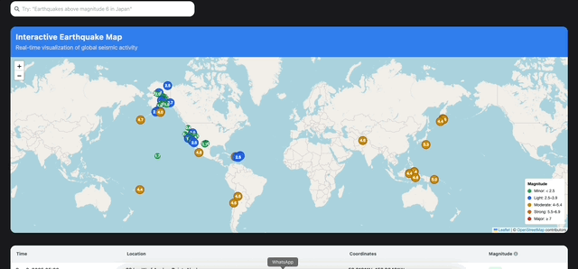

# QuakeWatch — Earthquake Monitoring Dashboard




A lightweight, interactive web app that displays recent earthquakes data on a map and in a list. Built for quick exploration, simple analytics, and a clean UX. Uses public data (USGS API) and supports prompt-style filtering (via Gemini).

---

## ✨ Main Features

- **Live data** from the [USGS Earthquake API](https://earthquake.usgs.gov/fdsnws/event/1/).
- **List and Map views** with:
  - Location
  - Magnitude
  - Time
- **Map integration** with Leaflet (via `react-leaflet`) with:
  - Legend for magnitude ranges so that users can quickly interpret marker colors/sizes.
- **Cross-highlighting:** clicking a list row focuses the corresponding map marker (and vice-versa).
- **Prompt-based input:** filter earthquakes using natural language queries (Don't forget! It _requires Gemini key_).
- **Basic performance tweaks:** memoized components & derived data.
- **Responsive UI** using Tailwind CSS.
- **Routing & Deep links** with React Router 7.
- **Performance optimizations:** memoized components to ensure smoother rendering, even as datasets grow.

---

## 🧰 Tech Stack

- **Framework:** React 19 (RC) + Vite 7
- **UI:** Tailwind CSS 4
- **Map:** Leaflet 1.9 + React Leaflet 5
- **Data fetching:** TanStack React Query 5
- **Routing:** React Router 7
- **Dates:** date-fns 4
- **Icons:** react-icons
- **AI:** `@google/generative-ai` (Gemini 1.5 Flash)
- **TypeScript**, ESLint

---

## 🚀 Getting Started

### Prerequisites
- **Node.js** ≥ 18.18
- **npm** ≥ 9 

### 1) Clone & Install
```bash
git clone https://github.com/sofiaoleaeuropaea/quake-watch.git
cd quake-watch
npm install
```

### 2) Environment Variables

All environment variables are defined in [`.env.example`](./.env.example).  
Copy it to `.env` and fill in the values.

```bash
cp .env.example .env
```

### 3) Run Dev Server

```bash
npm run dev
```

Then open http://localhost:5173

### 4) Build for Production

```bash
npm run buid
```

To preview the production build locally:

```bash
npm run preview
```

---

## 🗺️ Usage

The Dashboard provides two automatically synced views. So, as a user you can:
1. Open the dashboard to see a list of recent earthquakes and a synced map.  
2. Click on a list row to zoom the map to that earthquake and vice-versa.  
3. Use filters, like magnitude, time and region, or enter a natural language prompt to refine results.  

---

## 🧩 Data Source

[USGS Earthquake API](https://earthquake.usgs.gov/fdsnws/event/1/)

---

## 🧪 Design Notes

- **React Query** manages data fetching, caching, and background refresh.
- **Leaflet + React** Leaflet chosen for lightweight, proven web mapping.
- **Tailwind CSS** for responsive UI with minimal boilerplate.
- **Legend on the map** explains marker colors, helping the users to quickly interpret earthquake severity.  
- **Marker styling:** points vary in size and color by magnitude, providing an at-a-glance sense of impact.  
- **Tooltip on magnitude column** clarifies that magnitudes are measured using the Richter scale, improving user understanding.  
- **Pagination on the list** keeps the UI less crowded and ensures large datasets remain manageable for the user.  
- **Automatic refresh** ensures data is always current without manual reloads, improving real-time awareness. 
- **Accessibility features:** semantic HTML elements, keyboard navigation for key interactions, and screen-reader-friendly labels make the app usable for a wider audience.  

---

## 📄 Assumptions & Limitations

### Assumptions

- **Data Source**: The app relies on the USGS Earthquake API, which is assumed to be real-time and reliable enough for this demo.
- **Magnitude Scale**: All magnitudes are treated as Richter scale values. To make this clear, the magnitude column includes a tooltip.
- **Users**: The app is designed for both casual users and analysts who want to explore recent earthquake activity in a modern browser.
- **Deployment**: The app runs as a static site (e.g., on GitHub Pages) so, a backend service isn’t required for this scope.
- **Performance**: For the purposes of this demo and the amount of data returned by USGS, simple optimizations like memoization and pagination were considered enough.

### Limitations

- **RBAC**: Role-based access (e.g., admin vs. viewer) is not yet included. This feature would be best supported with a backend and can be added in a future iteration to provide finer-grained control over access and permissions.
- **Large Datasets**: Pagination and memoization help, but the app doesn’t yet include heavy-duty optimizations like virtualized tables or clustered map markers.
- **Offline Use**: The app depends on the live USGS feed, so it won’t work without an internet connection.
- **Design**: The styling was intentionally kept simple and functional, with the main focus on clarity and core functionality rather than a polished, production-ready look. In the future, more advanced data analysis features could be added, such as interactive charts or trend visualizations, e.g..